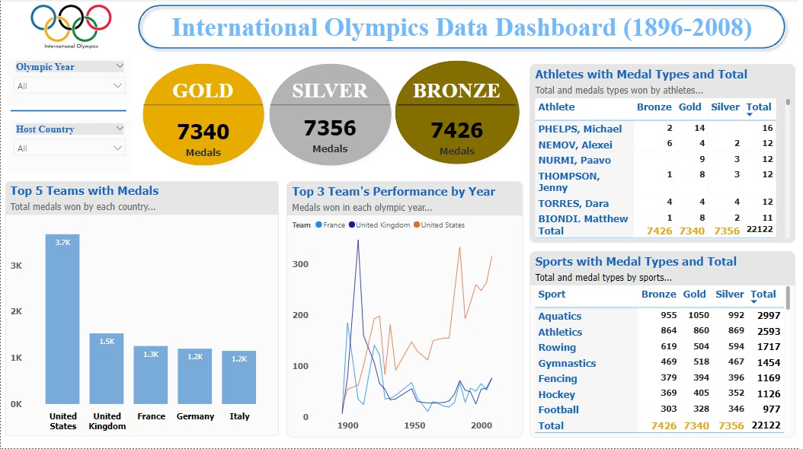

# International Olympics Data Dashboard

## A. Dashboard Design Approach:
- ### Description: 
  The dashboard displays the information about 120 years of International Olympics history ranging from year 1896 to 2008.

- ### Audience: 
  This dashboard is designed for students interested in sports activities, athletes, manufacturing companies, sports agencies.

- ### Goal:
1. Dashboard will help in understanding the performance of the best teams, players, and sports in terms of the total and types of medals won.
2. Users will have the flexibility to filter the information based on the specific Olympic year and the host country.
3. It is an interactive dashboard.

- ### Questions answered with dashboard:
1. What are the total number of medals won by types?
2. Which are the 5 best teams overall?
3. Performance of the top 3 teams overall by Olympic year.
4. Performance of the athletes with medal types and total medals.
5. Performance of the sports with medal types and total medals.

- ### Update Frequency: 
  Whenever new data is available.

## B. Metrics:
<table border=1>
    <tr>
        <th style="text-align:center;">Goal</th>
        <th style="text-align:center;">Metric</th>
        <th style="text-align:center;">Level of Detail</th>
    </tr>
    <tr>
        <td>Overall Information</td>
        <td>
            <ul>
                <li>Total medals</li>
                <li>5 Best teams</li>
            </ul>
        </td>
        <td>
            <ul>
                <li>Medal type</li>
                <li>Medal count</li>
            </ul>
        </td>
    </tr>
    <tr>
        <td>Performance</td>
        <td>
            <ul>
                <li>Top 3 team performance</li>
                <li>Athlete performance</li>
                <li>Sport performance</li>
            </ul>
        </td>
        <td>
            <ul>
                <li>Olympic year</li>
                <li>Medal type, Medal count</li>
                <li>Medal type, Medal count</li>
            </ul>
        </td>
    </tr>
</table>

## C. Visuals:
<table border=1>
    <tr>
        <th style="text-align:center;">Metric and Level of Detail</th>
        <th style="text-align:center;">Visual Type</th>
    </tr>
    <tr>
        <td>Total medals by medal type</td>
        <td>KPI Card</td>
    </tr>
    <tr>
        <td>5 Best teams with medal count</td>
        <td>Bar Chart</td>
    </tr>
    <tr>
        <td>Top 3 team performance by Olympic year</td>
        <td>Line Chart</td>
    </tr>
    <tr>
        <td>Athlete performance with medal type, medal count</td>
        <td>Table</td>
    </tr>
    <tr>
        <td>Sport performance with medal type, medal count </td>
        <td>Table</td>
    </tr>
</table>

## D. Dataset:
- Source: Downloaded from the Internet.
- Original dataset: Multi-table dataset available in ‘sio_120Y_ori.xlsx’ MS-Excel file.
- Pre-Processing: Follow the IPython Notebook ‘DA-IO.ipynb’ file.
- Final Dataset: Available in ‘sio_120Y_final.csv’ file.
- Total records: 22,122
- Total features: 12

<table border=1>
    <tr>
        <th style="text-align:center;">S.No.</th>
        <th style="text-align:center;">Feature</th>
        <th style="text-align:center;">Description</th>
    </tr>
    <tr>
        <td>1.</td>
        <td>Edition</td>
        <td>Year in which Olympic games held.</td>
    </tr>
    <tr>
        <td>2.</td>
        <td>Country</td>
        <td>Country where Olympic games were hosted.</td>
    </tr>
    <tr>
        <td>3.</td>
        <td>City</td>
        <td>City where Olympic games were played.</td>
    </tr>
    <tr>
        <td>4.</td>
        <td>Sport</td>
        <td>Main category for the event.</td>
    </tr>
    <tr>
        <td>5.</td>
        <td>Discipline</td>
        <td>Sub category for the event.</td>
    </tr>
    <tr>
        <td>6.</td>
        <td>Athlete</td>
        <td>Name of the athlete.</td>
    </tr>
    <tr>
        <td>7.</td>
        <td>Team</td>
        <td>National team of the athlete.</td>
    </tr>
    <tr>
        <td>8.</td>
        <td>NOC</td>
        <td>3-Letter notation for National Olympic Committee of the athlete.</td>
    </tr>
    <tr>
        <td>9.</td>
        <td>Gender</td>
        <td>Gender of the athlete.</td>
    </tr>
    <tr>
        <td>10.</td>
        <td>Event</td>
        <td>Event in which the athlete participated.</td>
    </tr>
    <tr>
        <td>11.</td>
        <td>Event_gender</td>
        <td>Gender of the event.</td>
    </tr>
    <tr>
        <td>12.</td>
        <td>Medal</td>
        <td>Type of the medal won by the athlete.</td>
    </tr>
</table>

## E. Final Dashboard:

## F. Future Enhancements:
- Dashboard can also include visuals showcasing performance for features such as Gender, Discipline, Event etc.
